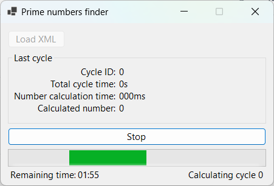

# Prime Numbers Finder

A C# WinForms application that calculates prime numbers in cycles.

## Features

- Prime numbers calculation in cycles lasting 2 minutes.
- Checking time for every cycle and number calculation.
- Exporting every cycle (with biggest calculated value and times) to XML file and starting new calculation using previous value as base after minute break.
- GUI in WinForms displaying remaining time and allowing for starting/stopping cycle calculation.

## Requirements

- .NET 8
- SQL Server
- Visual Studio 2022

## Installation

Clone repository, open solution in Visual Studio and build it. After successful build run application executable.

## Usage

Click "Start" button to start calculation. Application will ask for XML output file location and start calculation. Calculation will last 2 minutes, after that there will be one minute break before next calculation. 
Clicking "Stop" button will cause calculation to stop. If calculation was already pending then it will be stopped and saved to file. Opening XML file allows application to continue calculation stored in file. 
